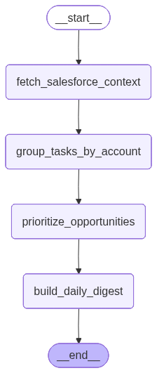

# Daily Prep Copilot

AI-powered GTM workflow that helps sales reps prioritize their pipeline and prepare for meetings.

## What It Does

- Fetches open opportunities from Salesforce
- Fetches today's Salesforce tasks as meeting context
- Scores opportunities using deterministic business logic
- Generates a prioritized daily pipeline digest
- Uses an LLM to create a pre-call meeting brief
- Saves output to `daily_digest.md`

## Architecture

Salesforce  
→ LangGraph workflow  
→ Priority scoring engine  
→ Brief generation  
→ Daily digest

The system uses LangGraph to orchestrate a multi-step GTM workflow:

1. Fetch CRM context from Salesforce
2. Aggregate account-level meeting context
3. Prioritize opportunities using deterministic scoring
4. Generate AI-powered meeting briefs
5. Produce a daily prep digest for sales reps

Business-critical prioritization is rule-based for explainability, while LLMs are used for narrative generation and recommendations.

## Workflow



## Run

```bash
python -m app.workflows.daily_prep_graph
